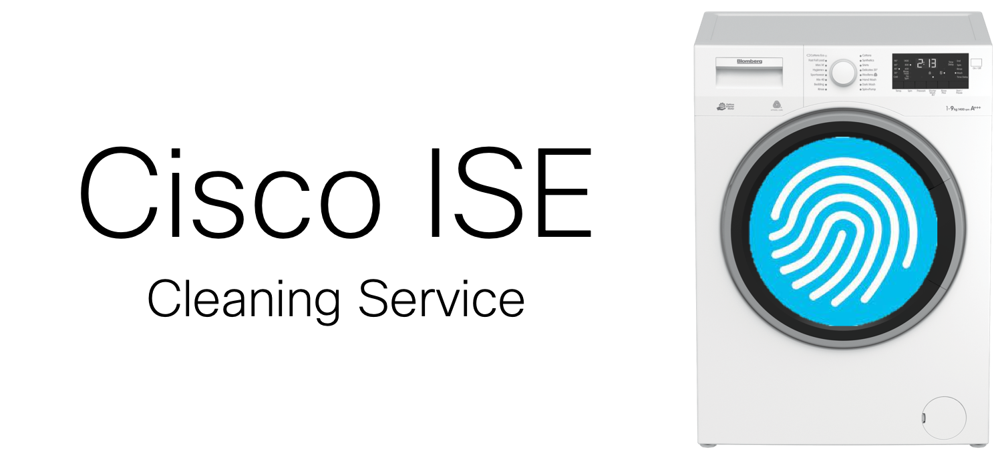

##### Keep ISE clean and tidy
## The Challenge

Cisco ISE (Identity Services Engine) is **THE** policy engine for your network. It provides many (many) different services that are all required to meet today's user expectations while protecting the organization from threats:
* TACACS+/RADIUS for central management of networking equipment.
* Network Admission Control (NAC) identifying endpoints as they connect to the network (both wired and wireless).
* Group-based Policy using Cisco TrustSec.
* VPN policy with Cisco ASA/FTD.
* Guest lifecycle management.
* Device profiling.
* And more...

In order to support scale of millions and millions of endpoints, Cisco ISE's profiling mechanism profiles and endpoint once and caches the endpoint's MAC address for the next time it authenticates.
Some organizations would prefer endpoints will be proviled every single time they connect to the network.

## The Solution

Using Cisco ISE's open APIs, primarily ERS (External RESTful Services), we have created "Cisco ISE cleaning service".
The cleaning service receives updates from Cisco ISE every time a profiled device is disconnected - and deletes the endpoint from ISE's DB, resulting in re-profiling end endpoint the next time it connects to the network.

## Running Cisco ISE cleaning service:

There are several options for running vanilla ISE:
1. Running the code on a computer/server with Python.
2. Running the code on a Docker container. Requires to <a href="https://docs.docker.com/get-docker/"> install Docker</a>.

### Enable ISE ERS API

The ISE REST APIs (AKA External RESTful Services or ERS) are disabled by default for security. You must enable it:
1. Login to your ISE PAN using the admin or other SuperAdmin user.
2. Navigate to **Administration** > **System** > **Settings** and select **ERS Settings** from the left panel.
4. Enable the ERS APIs by selecting **Enable ERS for Read/Write**
5. Do not enable CSRF unless you know how to use the tokens.
6. Select **Save** to save your changes.

Note: its good practice to disable CSRF to make sure you are able to authenticate successfully.

<a href="https://community.cisco.com/t5/security-documents/ise-ers-api-examples/ta-p/3622623#toc-hId--623796905"> Reference to official documentation </a>

### Tag relevant endpoint groups with #cleanup tag
Not all endpoint groups should be cleaned (for example, <a href="https://github.com/obrigg/Vanilla-ISE">Vanilla ISE</a>'s voucher group). In order to have granular support for the cleaning service - only endpoint groups that have "**#cleanup**" in their description will be cleaned.
1. Login to your ISE PAN using the admin or other SuperAdmin user.
2. Navigate to **Administration** > **Identity Management** > **Endpoint Identity Groups**.
3. Select an endpoint group you would like to clean using the cleaning service.
4. Add the "**#cleanup**" in the description field.
5. Don't forget to **save**. 

### Configure the cleaning service as a Syslog destination
In order to receive notifications from Cisco ISE, the service needs to be configured as a Syslog destination on ISE.
1. Login to your ISE PAN using the admin or other SuperAdmin user.
2. Navigate to **Administration** > **System** > **Logging** and select **Remote Logging Targets** from the left panel.
4. Add the cleaning service's IP address, and **save**.
5. Navigate to **Logging Categories** in the left panel, and select **RADIUS Accounting**.
6. Add the cleaning service from "available" to "**Selected**".
7. Select **Save** to save your changes.


### Set a environment variables file
```
ISE_IP= <ISE hostname/IP>
ISE_USER= <ISE username>
ISE_PASSWORD= <ISE password>
```

### Run the Docker
`docker run -d --env-file <path to env file> obrigg/ise-cleaner`

running the Docker in interactive mode:
`docker run -ti --env-file <path to env file>  obrigg/ise-cleaner`

----
### Licensing info
Copyright (c) 2021 Cisco and/or its affiliates.

This software is licensed to you under the terms of the Cisco Sample
Code License, Version 1.1 (the "License"). You may obtain a copy of the
License at

               https://developer.cisco.com/docs/licenses

All use of the material herein must be in accordance with the terms of
the License. All rights not expressly granted by the License are
reserved. Unless required by applicable law or agreed to separately in
writing, software distributed under the License is distributed on an "AS
IS" BASIS, WITHOUT WARRANTIES OR CONDITIONS OF ANY KIND, either express
or implied.
